# PRAKTIKUM-1

1. Pertama, harus mengetikkan *mysql -u root*, agar bisa masuk ke program mysql. Dan untuk membuat database lakukan perintah berikut :

```mysql
CREATE DATABASE latihan2;
```
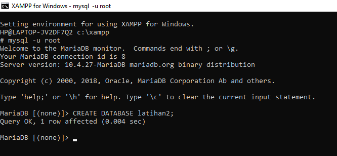

2. Buatlah sebuah database dengan nama *latihan2*, sebelum membuat tabel pastikan anda sudah memasukkan perintah :
```mysql
USE lathan2;
```
- setelah itu masukkan perintah dibawah ini untuk membuat tabel :
```mysql
CREATE TABLE biodata (nama VARCHAR(15), alamat VARCHAR(15));
```
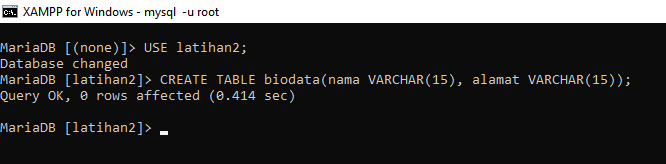

3. Menambahkan keterangan (varchar 15) sebagai kolom terakhir, masukkan perintah :
```mysql
ALTER TABLE biodata ADD keterangan VARCHAR(15);
```
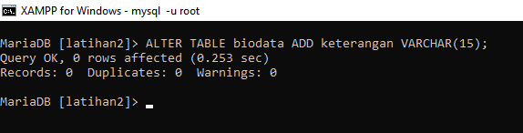

4. Menambahkan kolom id (int 11) sebagai kolom pertama, anda harus menambahkan FIRST untuk membuat kolom tersebut menjadi dibagian awal. perintahnya sebagai berikut :
``` mysql
ALTER TABLE biodata ADD id INT(11) FIRST;
```
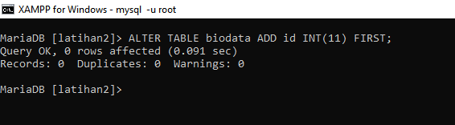

5. Sisipkan sebuah kolom dengan nama *phone* (varchar 15) setelah kolom alamat. Anda harus menambahkan AFTER untuk membuat kolom phone berada di setelah alamat, dengan perintah :
```mysql
ALTER TABLE biodata ADD phone VARCHAR(15) AFTER alamat;
```
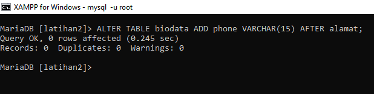

6. Mengubah tipe data kolom id menjadi char(11), maka perintah yang digunakan adalah :
```mysql
ALTER TABLE biodata MODIFY id CHAR(11);
```
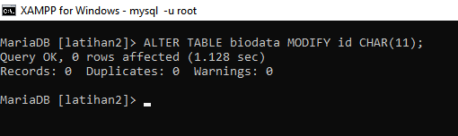

7. Mengubah nama kolom *phone* menjadi hp(varchar 20), perintahnya adalah :
```mysql
ALTER TABLE biodata CHANGE phone hp VARCHAR(20);
```
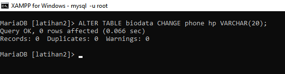

8. Menambahkan kolom email setelah kolom hp, anda harus menambahkan AFTER agar kolom email bisa berada setelah kolom hp, perintahnya adalah :
```mysql
ALTER TABLE biodata ADD email VARCHAR(15) AFTER hp;
```
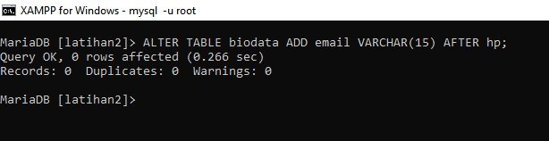

9. Menghapus kolom keterangan dari tabel, maka gunakan perintah :
```mysql
ALTER TABLE biodata DROP COLUMN keterangan;
```
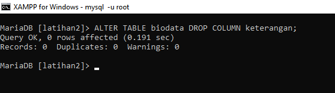

10. Mengganti nama tabel menjadi data_mahasiswa, dengan menggunakan perintah :
```mysql
ALTER TABLE biodata RENAME TO data_mahasiswa;
```
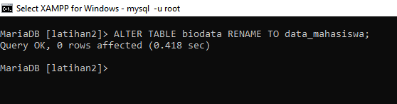

11. Mengganti nama field id menjadi nim, gunakan perintah :
```mysql
ALTER TABLE data_mahasiswa CHANGE id nim CHAR(11);
```
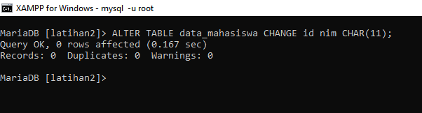

12. Menjadikan nim sebagai PRIMARY KEY, maka perintah yang digunakan adalah :
```mysql
ALTER TABLE data_mahasiswa ADD PRIMARY KEY (nim);
```

13. Menjadikan kolom email sebagai UNQUE KEY, perintahnya adalah :
```mysql
ALTER TABLE data_mahasiswa ADD UNIQUE KEY (email);
```
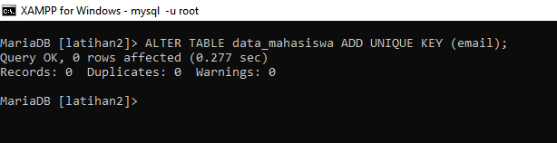

14. hasil output akhir dari perintah secara keseluruhan adalah sebagai berikut :

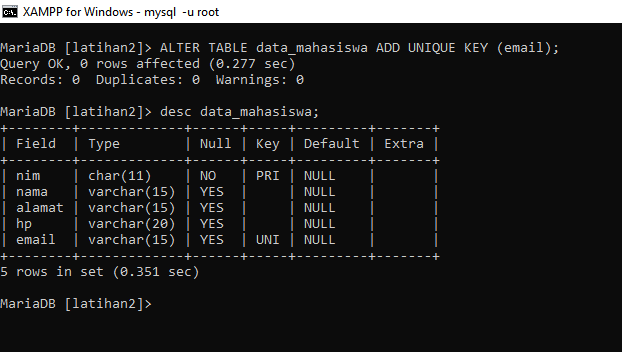

# EVALUASI & PERTANYAAN

- Apa yang dimaksud dari int(11)?

=> int(11) adalah salah satu tipe data dalam MySQL. Tipe data int digunakan untuk menyimpan nilai bilangan bulat (integer), sedangkan angka 11 menunjukkan panjang maksimum dari bilangan yang dapat disimpan dalam kolom tersebut. Angka 11 di sini menunjukkan panjang maksimum dari digit yang dapat disimpan dalam kolom tersebut, bukan jumlah angka yang dapat disimpan.

- Ketika kita melihat struktur tabel dengan perintah desc, ada kolom Null yang berisi Yes dan No. Apa maksudnya?

=> Jika nilai Null pada kolom tersebut adalah YES, itu berarti kolom tersebut diizinkan untuk memiliki nilai NULL, artinya kolom tersebut tidak harus selalu memiliki nilai saat data dimasukkan ke dalam tabel. Sebaliknya, jika nilai Null pada kolom tersebut adalah NO, kolom tersebut tidak diizinkan untuk memiliki nilai NULL, sehingga setiap data yang dimasukkan ke dalam tabel harus memasukkan nilai untuk kolom tersebut.
